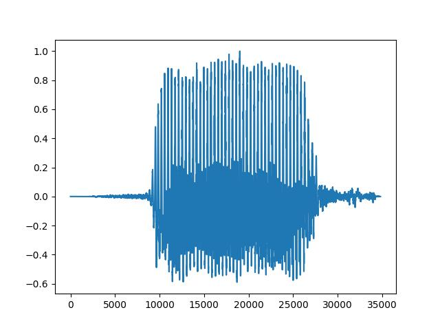
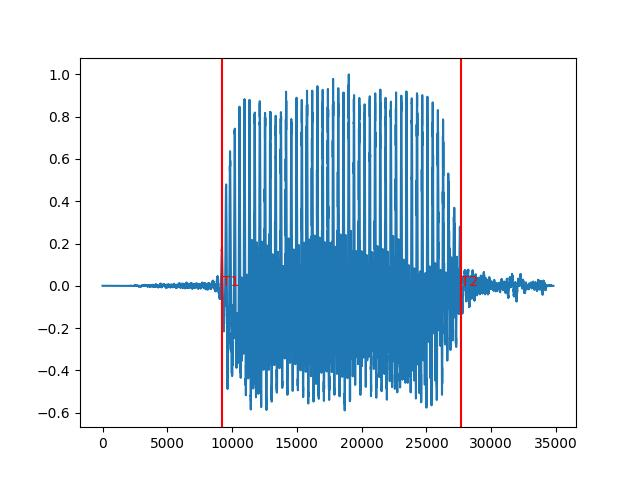
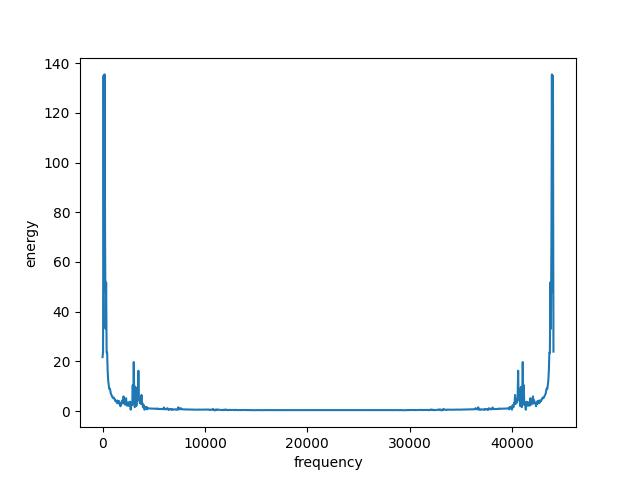
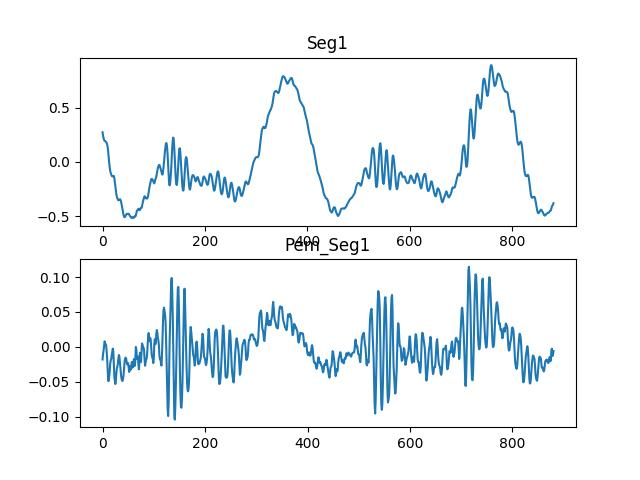
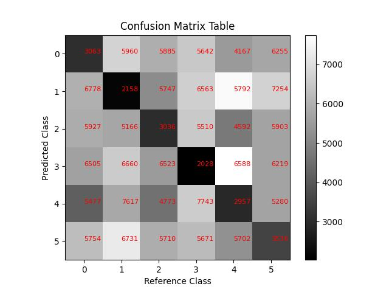

# Overall

The code used in the part 4 is all located in the [signal_analysis.py](./signal_analysis.py) file. Before running, you need to pay attention to modifying the file path when reading the file. Since the editor will report an error when I use the relative path, I can only use the absolute path to read the file. The files that need to be read are located in the set-A and set-B folders. The handling of file path issues mentioned here also needs to be implemented in the part 5.

The code for the part 5 is all in the [speech_recognition.py](./speech_recognition.py) file. After importing the library required by the file and modifying the file path to a relative path, it can be executed.
In addition, it should be noted in this part that the 5c part is run by default when the program is executed. If you need to run the 5d part to obtain the optimal_path, you need to add and delete the comments in the corresponding position according to the instructions in the code.

Here are the results of my work.

## Part 1-2

***Note: Because my student number only contains three numbers. So in addition to the numbers 1, 5 and 7, I chose three other numbers 2, 3 and 9.***

After recording the initial audio with my mobile phone, then I converted the file to .wav format  and set the sampling rate to **44100** and the data width to **16** bits. Here are the two data sets obtained.

- [setA](./set-A)
- [setB](./set-B)

## Part 3

In this part, I choose to process the s1a.wav file, and the result [s1A.jpg](./s1A.jpg) is shown below.

## Part 4

### a

Here the processing is continued based on the previously selected s1A.wav, and T1 and T2 are obtained by calculating the number of zero crossing and energy level. the following figure shows the obtained results. 

### b

The Seg1 selected here was manually intercepted after calculating the sample data, and the location of the segment is shown in the figure below.

### c

- [fourier_code.txt](./result/fourier_code.txt)
- 

### d

- [pre-em.txt](./result/pre-em.txt)
- 

### e

- [lpc.txt](./result/lpc.txt)
- [lpc-parameters](./result/lpc10.txt)

## Part 5

- [code](./speech_recognition.py)
- 

In this part, the program reads the wav files sequentially, with the horizontal coordinates being the template data and the vertical coordinates being the testing data.As shown in the graph, the darker the color, the lower the accumulated score, as expected.

Then I selected s1A.wav and s1B.wav (their contents are both “1” in Mandarin) to find the minimum accumulated distance as well as to get the optimal path. The results are shown in the figure below.

