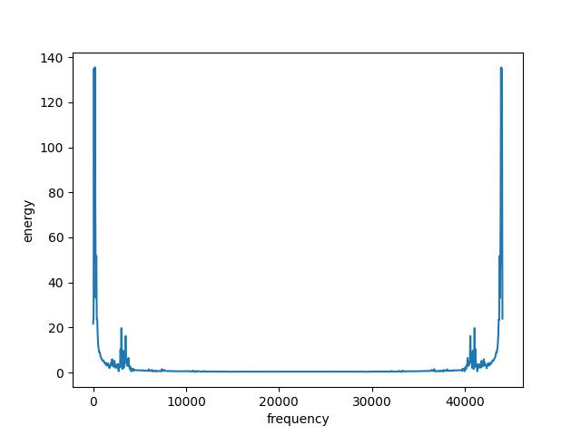

# Overall

## Part 1-2

***Note: Because my student number is 1155177751, which only contains three numbers. So in addition to the numbers 1, 5 and 7, I chose three other numbers 2, 3 and 9.***

After recording the initial audio with my mobile phone, then I converted the file to .wav format  and set the sampling rate to **44100** and the data width to **16** bits. Here are the two data sets obtained.

- [setA](./set-A)
- [setB](./set-B)

## Part 3

In this part, I choose to use [plot.py](./plot.py) to process the s1a.wav file, and the result [s1A.jpg](./s1A.jpg) is shown below.

## Part 4

### a

Here the processing is continued based on the previously selected s1A.wav, and T1 and T2 are obtained by calculating the number of zero crossing and energy level. the following figure shows the obtained results. 

### b

The Seg1 selected here was manually intercepted after calculating the sample data, and the location of the segment is shown in the figure below.

### c

- [code](./fourier_code.txt)
- 

### d

- [code](./pre-em.txt)
- 

### e

- [code](./lpc.txt)
- [lpc-parameters](./lpc10.txt)

## Part 5

- [code](./speech_recognition.py)
- 

In this part, the program reads the wav files sequentially, with the horizontal coordinates being the template data and the vertical coordinates being the testing data.As shown in the graph, the darker the color, the lower the accumulated score, as expected.

Then I selected s1A.wav and s1B.wav (their contents are both “1” in Mandarin) to find the minimum accumulated distance as well as to get the optimal path. The results are shown in the figure below.

