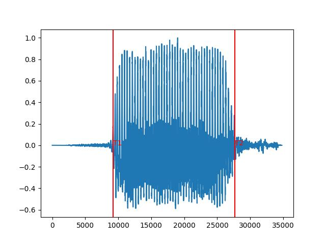

# Overall

## Part 1-2

***Note: Because my student number is 1155177751, which only contains three numbers. So in addition to the numbers 1, 5 and 7, I chose three other numbers 2, 3 and 9.***

After recording the initial audio with my mobile phone, then I converted the file to .wav format  and set the sampling rate to 44100 and the data width to 16 bits. Here are the two data sets obtained.

- [setA](./set-A)
- [setB](./set-B)

## Part 3

In this part, I choose to use [plot.py](./plot.py) to process the s1a.wav file, and the result [s1A.jpg](./s1A.jpg) is shown below.

## Part 4

### a

Here the processing is continued based on the previously selected s1A.wav, and T1 and T2 are obtained by calculating the number of zero crossing and energy level. the following figure shows the obtained results. (Note that the horizontal coordinates are different from s1A.jpg, which is twice as large, because the sampling data format was changed during the processing)

### b

### c

### d

### e
